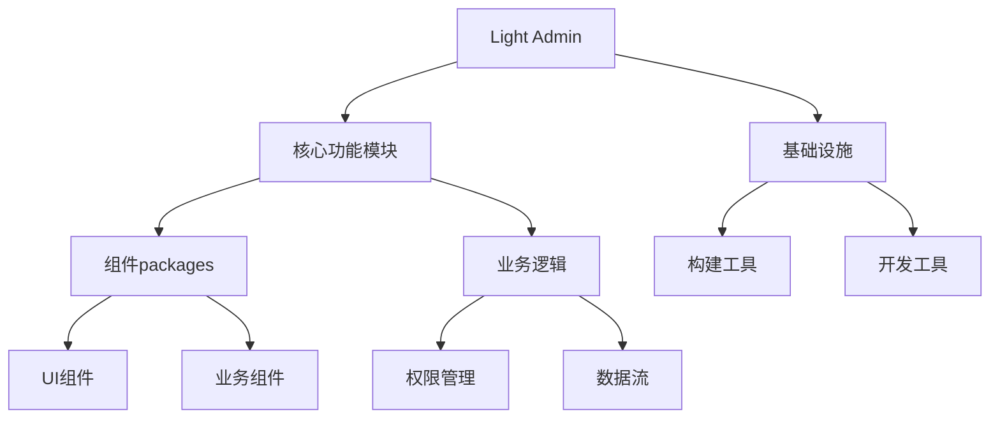

# Light Admin

基于Vue3的现代化轻量级管理系统框架，专注于组件的可视化配置和业务逻辑的快速实现。

[English](./README.md) | [简体中文](./README.zh-CN.md)

## 核心特性

- **模块化架构**: 基于pnpm workspace的多包管理方案
- **组件系统**: 
  - 可视化配置的组件库
  - 模块化的组件设计
  - 统一的组件规范
- **TypeScript支持**: 完整的类型定义和类型推导
- **国际化**: 内置完善的多语言支持
- **主题定制**: 灵活的主题配置系统
- **权限管理**: 细粒度的权限控制机制
- **开发工具链**: 完整的开发、构建、部署工具支持

## 技术架构



## 项目结构

```bash
├── packages/           # 核心功能模块
│   ├── components/    # UI组件库
│   ├── design/       # 设计系统
│   ├── hooks/        # 可复用的逻辑钩子
│   ├── layouts/      # 布局组件
│   ├── views/        # 页面组件
│   ├── store/        # 状态管理
│   └── utils/        # 工具函数
├── src/              # 主应用源码
├── mock/             # 模拟数据
├── public/           # 静态资源
└── types/            # 类型定义
```

## 快速开始

### 环境准备

- Node.js 16+
- pnpm 7+

### 安装

```bash
pnpm install
```

### 开发

```bash
pnpm dev
```

### 构建

```bash
pnpm build
```

## 开发指南

- [组件开发规范](./docs/component-guide.md)
- [主题定制指南](./docs/theme-guide.md)
- [国际化配置](./docs/i18n-guide.md)
- [权限配置](./docs/permission-guide.md)
- [API集成指南](./docs/api-guide.md)

## 部署说明

### Docker部署

项目提供了完整的Docker支持，详见 [Docker部署指南](./docs/docker-guide.md)。

### 环境配置

- 支持多环境配置（development/production/test）
- 使用.env文件进行环境变量管理
- 详细配置说明见 [环境配置指南](./docs/env-guide.md)

### 性能优化

- 静态资源优化
- 代码分割
- 懒加载
- 详见 [性能优化指南](./docs/performance-guide.md)

## 贡献指南

我们非常欢迎你的贡献，你可以通过以下方式和我们一起共建：

- 提交 [Issue](https://github.com/your-username/light-admin/issues)
- 提交 [Pull Request](https://github.com/your-username/light-admin/pulls)

请确保在提交之前阅读 [贡献指南](./CONTRIBUTING.md)。

## 更新日志

详见 [CHANGELOG](./CHANGELOG.md)

## 许可证

[MIT](./LICENSE)
